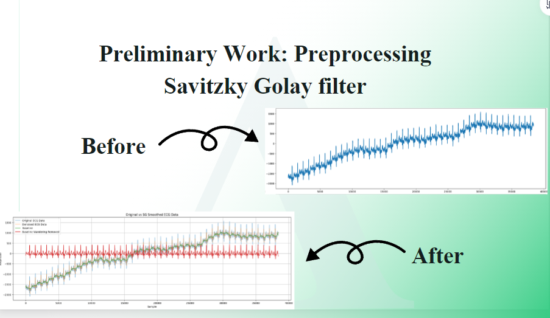
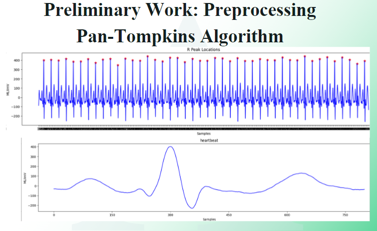
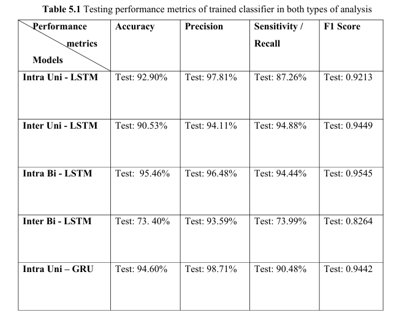
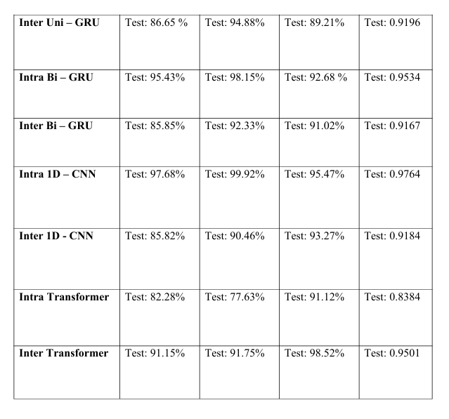

# Automatic Detection of Myocardial Infarction (MI) using ECG Signals with Artificial Intelligence

This is my final year project during my bachelor's degree.

The preprocessing is designed for the dataset from PhysioNet: https://www.physionet.org/content/ptbdb/1.0.0/

This research focused on the effects caused by inter-patient splitting and intra-patient splitting methods. The results of the preprocessing and detection were attached below.

